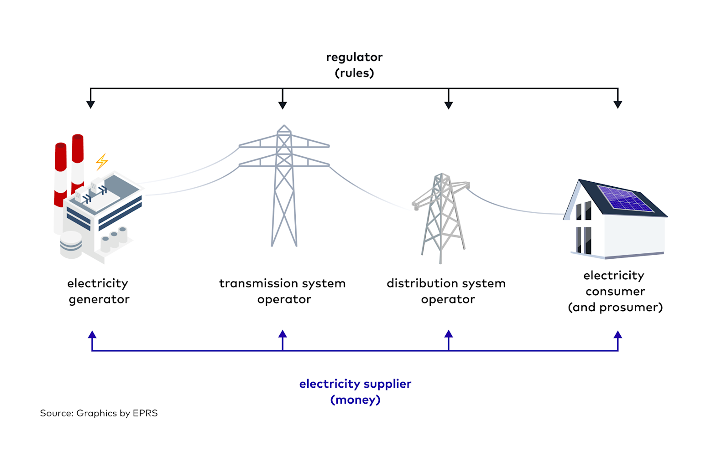
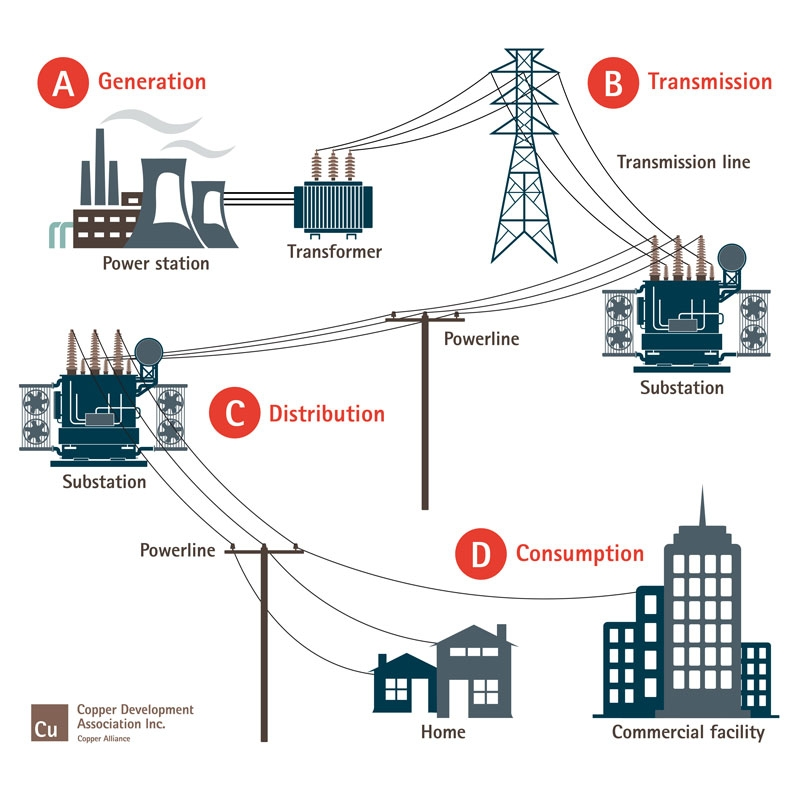
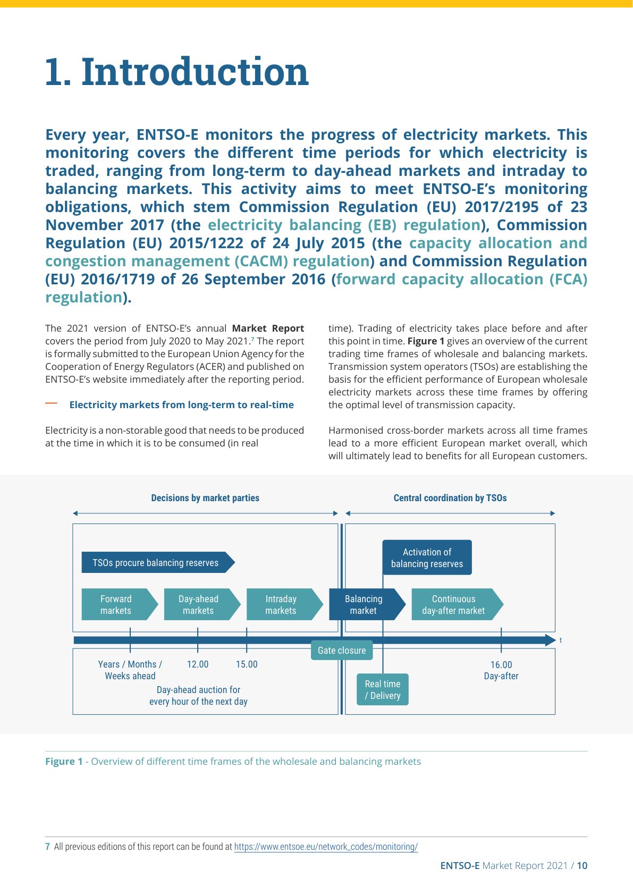
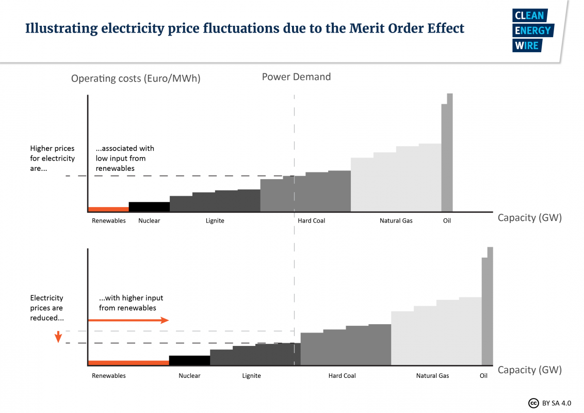

# [Electricity Markets]{.flow} {.title}

## Introduction

The electricity market is the invisible backbone of modern society, determining how electricity flows from generators to our homes and businesses. Unlike other commodities, electricity cannot be easily stored and must be produced exactly when it's consumed, making this market uniquely complex and fascinating.

**Key Questions We'll Answer:**

- How are electricity prices set?
- Who are the key players?
- What makes this market unique?
- Is marginal pricing still optimal in the era of renewables?

# [What Is an Electricity Market?]{.flow} {.title}

## Definition

An electricity market is a sophisticated system where electricity is bought, sold, and traded as a commodity, connecting producers with consumers through organized exchanges and bilateral contracts.

**Unique Characteristics:**

- Must balance supply and demand in real-time
- Cannot be stored economically at scale
- Requires instantaneous matching of generation and consumption

## Key Participants

- **Generators**: Power plants, renewable energy producers
- **Transmission System Operators (TSOs)**: Manage high-voltage networks
- **Distribution System Operators (DSOs)**: Deliver power to end users
- **Suppliers/Retailers**: Buy wholesale, sell to consumers
- **Market Operators**: Facilitate trading (e.g., EPEX SPOT)
- **Regulators**: Ensure fair competition and system reliability

{width="85%"}

*Source: Illustrative diagram for this lecture; conceptual basis — [ETPA grid operators](https://www.etpa.nl/knowledge-base/players/grid-operators), [Eurelectric](https://www.eurelectric.org/in-detail/distributiongridsforspeed/). See `img/SOURCES.md`.*

# [How Electricity Is Generated and Supplied]{.flow} {.title}

## Electricity Supply Chain

The electricity supply chain consists of four distinct stages, each with specific infrastructure and responsibilities:

**1. Generation**: Power plants convert various energy sources into electricity

- **Renewable**: Wind (marginal cost ≈ €0/MWh), Solar (≈ €0/MWh)
- **Nuclear**: Low marginal costs (≈ €10-15/MWh)
- **Fossil Fuels**: Coal (≈ €20-40/MWh), Natural Gas (≈ €40-80/MWh)
- **Peak Plants**: Oil/Gas turbines (≈ €80-200/MWh)

**2. Transmission**: High-voltage networks (110-400 kV) transport electricity over long distances

**3. Distribution**: Medium and low-voltage networks deliver power locally

**4. Consumption**: End users receive electricity through meters and local connections

{width="85%"}

*Source: Illustrative diagram for this lecture; conceptual basis — [SMARD electricity market](https://www.smard.de/page/en/wiki-article/5884/5840/this-is-how-the-electricity-market-works). See `img/SOURCES.md`.*

# [Market Structure and Types]{.flow} {.title}

## Wholesale Markets

- **Purpose**: Large-scale trading between generators and suppliers
- **Volumes**: Typically hundreds of MWh per transaction
- **Participants**: Power plants, utilities, large industrial consumers
- **Price Volatility**: High - can fluctuate from negative to €1000+/MWh
- **Trading Timeframes**: Years ahead to real-time (15-minute intervals)

## Retail Markets

- **Purpose**: Supply electricity to end consumers
- **Participants**: Households, small businesses, industrial customers
- **Price Stability**: More stable, often fixed contracts
- **Additional Costs**: Include distribution, transmission, taxes, supplier margins
- **Regulation**: Heavily regulated to protect consumers

## Market Structures

- **Regulated**: Single utility, government-set prices
- **Liberalized**: Competition among suppliers, market-based pricing

# [Market Layers and Time Horizons]{.flow} {.title}

## Forward and Futures Markets

- Provide long-term price signals and risk mitigation
- Enable financing of capital-intensive projects (renewables, nuclear)
- Include standardized contracts traded on exchanges and bilateral agreements
- Influence behavior in spot markets via hedging

## Day-Ahead Market

- Centralized market clearing typically runs once daily
- Participants submit supply offers and demand bids by 12:00 noon
- Market operator optimizes to balance forecasted demand and supply at minimum cost
- Covers a large share of total electricity demand
- Results published around 13:00 for next day's delivery
- **Since October 2025**: 15-minute products in European day-ahead coupling (SDAC), replacing hourly-only trading in most bidding zones

## Intraday Market

- Continuous or multiple auctions until close to delivery
- Allows participants to adjust positions based on updated forecasts
- Critical for managing variability from renewables and demand uncertainty
- Trading until 15 minutes before delivery
- Increasing liquidity and granularity as renewables share grows

## Balancing Market

- Transmission System Operators (TSOs) activate reserves to maintain supply-demand balance in real-time
- Procures balancing capacity ahead and energy as needed
- Relies on fast-ramping generators, storage, demand response
- Ensures frequency, voltage, and grid stability

## Types of Balancing Reserves

| Type | Name | Product | Activation | Pricing | Platform |
|------|------|---------|------------|---------|----------|
| **FCR** | Frequency Containment Reserve (Primärreserve) | Power-only (positive & negative together) | Automated | Pay-as-clear | National |
| **aFRR** | Automatic Frequency Restoration Reserve (Sekundärreserve) | Separate power & energy (positive & negative) | Automated | Pay-as-bid | PICASSO |
| **mFRR** | Manual Frequency Restoration Reserve (Minutenreserve) | Separate power & energy (positive & negative) | Manual | Pay-as-bid | MARI |

**PICASSO** (Platform for the International Coordination of Automatic Frequency Restoration and Stable System Operation): Automatically activates secondary reserve across European borders in real-time.

**MARI** (Manually Activated Reserves Initiative): Central European platform for market-based exchange of minute reserve (mFRR), activated manually by TSOs in response to system needs.

{width="85%"}

*Source: ENTSO-E Market Report 2021, Figure 1 — [ENTSO-E monitoring](https://www.entsoe.eu/network_codes/monitoring/). Related analysis: @Tolstrup2020.*

# [Trading Electricity]{.flow} {.title}

## Trading Process

1. **Supply Bids**: Generators offer electricity at specific prices
2. **Demand Bids**: Suppliers/large consumers bid for required volumes
3. **Market Clearing**: Computer algorithms match supply and demand
4. **Price Discovery**: Marginal pricing determines uniform market price

{width="25%"}

*Source: Illustrative stock image for trading operations (lecture compilation). See `img/SOURCES.md`.*

# [Price Formation: Merit Order & Marginal Pricing]{.flow} {.title}

## How Merit Order Works

1. **Ranking**: Power plants bid their marginal costs (fuel + operating costs)
2. **Stacking**: Plants are arranged from cheapest to most expensive
3. **Selection**: Starting with the cheapest, plants are activated until demand is met
4. **Price Setting**: The most expensive activated plant sets the market price for **ALL** generators

## Typical Merit Order (€/MWh)

1. **Renewables**: €0-5 (no fuel costs)
2. **Nuclear**: €10-15 (low operating costs)
3. **Lignite/Coal**: €20-40 (fuel costs)
4. **Natural Gas**: €40-80 (higher fuel costs)
5. **Oil/Peak Plants**: €80-200+ (emergency use)

## Merit Order Effect

Renewables push expensive plants out of the market, reducing overall prices.

**Example**: In 2020, renewables provided 45% of German electricity, reducing average wholesale prices by an estimated €20/MWh compared to a fossil-only system.

**Key Insight**: Low marginal cost renewables enter first, depressing prices during high output periods but creating steep price ramps in scarcity.

{width="85%"}

*Source: Illustrative diagram for this lecture; conceptual basis — [Next Kraftwerke merit order](https://www.next-kraftwerke.com/knowledge/what-does-merit-order-mean), [Clean Energy Wire](https://www.cleanenergywire.org/factsheets/setting-power-price-merit-order-effect). See `img/SOURCES.md`.*

# [The Role of Grid Operators]{.flow} {.title}

## Transmission System Operators (TSOs)

**Primary Function**: Maintain grid stability across large regions

**Key Responsibilities**:

- Balance supply and demand in real-time
- Operate high-voltage transmission networks (110-400 kV)
- Manage cross-border electricity flows
- Procure balancing services (frequency regulation, reserves)
- Plan network expansion and maintenance

## Distribution System Operators (DSOs)

**Primary Function**: Deliver electricity to end consumers

**Key Responsibilities**:

- Operate medium (6-50 kV) and low voltage (230-400 V) networks
- Connect new consumers and distributed generation
- Manage local grid congestion
- Install and maintain smart meters

**Example**: Germany has 4 TSOs managing control areas, while over 800 DSOs handle local distribution

# [Renewable Energy and the Market]{.flow} {.title}

## Market Integration Challenges

**Variability**: Wind and solar output depends on weather conditions

- German solar can vary from 0 to 40+ GW within hours
- Wind power fluctuations create price volatility

**Near-Zero Marginal Costs**: Renewables bid at €0-5/MWh, displacing conventional plants

- **Merit Order Effect**: Lower wholesale prices when renewables are abundant but steep price ramps when renewables are scarce
- **Negative Prices**: During high renewable output and low demand

## Market Adaptations

**Flexibility Services**:

- Battery storage systems
- Demand response programs
- Power-to-X technologies (hydrogen production)

**Grid Infrastructure**:

- Smart grid technology
- Enhanced transmission capacity
- Better forecasting systems

# [European Energy Crisis]{.flow} {.title}

## Context: The Crisis (2021-2022)

- Since early 2021, Russia drastically cut natural gas supplies to Europe
- Near-total halt mid-2022, driving gas prices up by more than tenfold
- Electricity prices soared to unprecedented levels
  - Peak wholesale prices >€560/MWh
  - Historical average ~€40/MWh

## Effects on Market Operations

- Gas price surges amplify electricity prices (gas plants often set marginal prices)
- Nuclear outages, drought-reduced hydro, and coal supply constraints exacerbated supply tightness
- Liquidity strains in markets emerged as firms faced margin calls
- Renewables saw windfall profits during price spikes, triggering political calls for windfall taxes

::: {.callout-note}
**Windfall profits** are unusually high revenues that generators earn when market prices spike far above their marginal production costs. During the 2021–2022 crisis, many renewables and low-marginal-cost plants were still paid the high **marginal market price** (merit order), even though their operating costs did not rise with gas. Governments responded with temporary revenue caps and windfall taxes (e.g. EU emergency measures in 2022) to fund consumer relief — while debating whether such interventions distort long-term investment signals.
:::

## Exposed Vulnerabilities

- Energy dependence on single suppliers
- Market design limitations under extreme conditions
- Affordability challenges for vulnerable consumers and energy-intensive industries

# [Current Market Design Debates]{.flow} {.title}

## Is Marginal Pricing Still Optimal?

**Arguments for Marginal Pricing**:

- Ensures short-run economic efficiency
- Reflects true cost of the last unit needed
- Encourages efficient dispatch

**Arguments Against**:

- Creates revenue uncertainty for investors
- Can lead to windfall profits for some generators
- Political concerns during price spikes
- Investment signals complicated by increasing renewables

::: {.callout-note}
The **2024 EU electricity market reform** explicitly **kept marginal pricing** in day-ahead markets. The debate has shifted toward complementary instruments (CfDs, PPAs, capacity mechanisms) rather than replacing the merit-order principle.
:::

## The Missing Money Problem

- Insufficient revenue for backup capacity that runs infrequently
- Conventional plants needed less often but critical for system reliability
- Reduced running hours affect economic viability

# [German Electricity Market: Current Discussions]{.flow} {.title}

## Market Complexity and Digitalization

- Market consists of numerous actors: grid operators, traders, generators, storage and direct marketers
- High manual effort and lack of digitalization hinder efficient cooperation
- **Digitalization** is key to integrating actors and increasing flexibility
- Example: Automated flexibility platforms can make load shifting and peak management more efficient

## Market Economy vs. State Intervention

**Critics of Increasing Interventions**:

- Market prices are essential for innovation and investment
- Current volatile market prices create new business models (e.g., battery storage through arbitrage)
- State interventions (capacity mechanisms, industrial electricity prices) can distort and dilute price signals

**Proponents of Interventions**:

- Some interventions are politically necessary to ensure acceptance and supply security
- Balance needed between efficiency and steering

# [Industrial Electricity Price Debate]{.flow} {.title}

## Arguments For

- Protects industrial competitiveness against high energy prices
- Prevents production relocation abroad
- Maintains employment in energy-intensive sectors

## Arguments Against

- Market distortions through dampened price signals
- Uncertainties in practical implementation (e.g., how new contracts/PPAs are accounted for)
- Lack of incentive for flexibility offers or efficiency improvements
- Delays energy transition

## Alternative Proposals

- Focus on tax/levy-based relief instruments instead of direct price caps
- More targeted support mechanisms

# [Supply Security and Capacity Mechanisms]{.flow} {.title}

## Capacity Mechanisms

**Purpose**: Reward investors for needed power plant capacities that run rarely but are system-critical

**Criticisms**:

- Often seen as state-organized procurement without real competition
- High bureaucratic effort and distortions
- Complex search for market-based but reliable security mechanisms

## Alternative Models

- Market-based security obligations
- Mandatory security obligations for generation capacities
- However, similarly complex with high transaction costs

**Consensus**: With further phase-out of conventional generation, alternatives for supply security are required

::: {.callout-note}
**Germany (2025–2026):** The federal government is introducing a **capacity mechanism** under the *Stromversorgungssicherheits- und Kapazitätsgesetz* (StromVKG). First auctions for **long-duration capacity** (≥10 h) are planned from September 2026, with broader technology-neutral capacity auctions to follow. The aim is to secure dispatchable backup capacity as coal and nuclear exit while renewables share grows.
:::

# [Recent Developments (2024–2026)]{.flow} {.title}

## EU Electricity Market Reform

- **Regulation (EU) 2024/1747** adopted May 2024, in force from July 2024
- **Marginal pricing retained** for day-ahead markets — short-term price signals remain central
- **Two-way CfDs mandatory** for new publicly supported renewable and low-carbon generation
- Stronger consumer protection: more contract choice, PPAs promoted, crisis-response tools for Member States
- Excess CfD revenues to be passed on to consumers where applicable

## Market Granularity and Flexibility

- **15-minute day-ahead products** live across Europe since 1 October 2025 ([EPEX SPOT](https://www.epexspot.com/en/15-minute-products-market-coupling))
- Aligns trading with 15-minute imbalance settlement and higher renewable shares
- **Intraday markets** absorb growing correction volumes; gate closure moves closer to real-time
- Rising **negative prices** and **capture-rate** effects for solar/wind as midday supply surges

## Germany in 2026

- Renewables exceed ~50% of generation; wholesale prices more volatile (midday lows, evening peaks)
- Net electricity **exporter** again in early 2026 after import-heavy years
- **Capacity mechanism** (StromVKG) and industrial electricity price debates continue
- Digitalization of flexibility trading remains a priority

# [Market Reform Proposals]{.flow} {.title}

## Contracts for Difference (CfDs)

- Long-term contracts offering fixed price support to generators
- Reduces market revenue volatility and investment risk
- Complementary to market pricing rather than replacing it
- **Challenge**: Potential market distortions if widely applied

::: {.callout-note}
A **Contract for Difference (CfD)** is a two-way hedge between a generator and a counterparty (often a public entity). A **strike price** is agreed in advance. The plant still sells electricity on the wholesale market, but any difference between the market price and the strike price is settled afterwards: if the market price is **below** the strike price, the generator receives a top-up; if it is **above**, excess revenues are typically returned (under EU rules, often to consumers). This gives investors revenue stability without removing plants from market dispatch. Since 2024, EU law requires new publicly supported renewable and low-carbon investments to use two-way CfDs ([Regulation (EU) 2024/1747](https://www.consilium.europa.eu/en/policies/electricity-market-reform/)).
:::

## Market Splitting

- Separate market mechanisms for renewables and conventional generation
- Reflects different cost and risk profiles
- Could improve investment signals and operational efficiency
- **Challenge**: Requires innovative design to coordinate interaction and maintain overall efficiency

## Short-Term Regulatory Interventions

- Price caps on gas or electricity (e.g., Spain's gas price cap)
- Windfall profit taxes on generators benefiting from market spikes
- **Pros**: Immediate consumer relief and political feasibility
- **Cons**: Potential dampening of market signals and liquidity impacts

## Enhancing Market Granularity

- **15-minute day-ahead markets** implemented in EU coupling since October 2025
- Increasing intraday liquidity to reduce balancing risk for market participants
- Valuing flexibility from storage, demand response, and interconnections
- Incorporating improved renewable forecasting

# [Digitalization and Flexibility]{.flow} {.title}

## Digitalization as Key Enabler

- Facilitates real-time data availability
- Enables automated market processes
- Improves efficiency in energy trading
- Enhances coordination between market actors

## Flexibility Services

- Storage systems (batteries, pumped hydro)
- Demand-side management
- Cross-sectoral integration (sector coupling)
- Enable better integration of renewable energies
- Stabilize systems with variable feed-in

## Future Perspective

- More integration of all actors
- Technology-neutral and market-economically supported
- No radical system break planned
- Balanced adjustments to improve system efficiency and supply security

# [Mathematical & Economic Modeling]{.flow} {.title}

## Optimization in Market Operations

- **Unit commitment and economic dispatch**: Mixed-integer programming optimizes plant operation schedules
- **Game theory and strategic bidding**: Generators optimize bids under market rules to maximize profits under uncertainty
- **Stochastic forecasting**: Probabilistic models for weather-dependent renewables

## Tools and Technologies

- **Julia, Python**: For modeling complex interactions
- **PLEXOS, GAMS**: Specialized optimization software
- Enable exploring policy impacts and simulating market outcomes

## Skills for Energy Professionals

- Deep understanding of physical grid constraints, market rules, and policy frameworks
- Proficiency with modeling tools (Python, Julia, specialized optimization software)
- Capacity to assess impacts of evolving technologies (storage, hydrogen) and regulatory changes
- Ability to support policy design balancing sustainability, security, affordability, and market integrity

# [Discussion Questions]{.flow} {.title}

## Critical Questions for Debate

1. **Is marginal pricing still optimal?**
   - Does it ensure efficiency while providing adequate investment signals?
   - How should we handle windfall profits during price spikes?

2. **Market vs. Regulation Balance**
   - How much state intervention is acceptable?
   - Can we maintain market efficiency while ensuring supply security?

3. **Industrial Electricity Price**
   - Should energy-intensive industries receive price protection?
   - What are better alternatives to direct price caps?

4. **Capacity Mechanisms**
   - Are capacity markets necessary or can market-based solutions work?
   - How to ensure investment in rarely-used but critical capacity?

5. **Digitalization and Flexibility**
   - How can digitalization improve market efficiency?
   - What role should flexibility services play in future markets?

6. **Market Segmentation**
   - Should renewables and conventional generation be in separate markets?
   - How would this impact investment incentives?

# [Summary and Conclusions]{.flow} {.title}

## Key Takeaways

1. **Merit Order System**: Ensures economic efficiency by dispatching cheapest generation first
2. **Real-Time Balance**: Supply and demand must match exactly every second
3. **Multiple Markets**: Day-ahead, intraday, and balancing markets work together
4. **Infrastructure Critical**: TSOs and DSOs maintain system reliability
5. **Renewable Integration**: Transforming market dynamics and requiring new flexibility solutions

## Current Challenges

- Price volatility from renewable intermittency and fuel price shocks
- Grid infrastructure needs (€750 billion required in Europe by 2030)
- Market design issues (missing money problem, capacity mechanisms)
- Regulatory complexity balancing competition with reliability

## Looking Forward

The electricity market needs a balanced framework that:

- Preserves the dynamics of market prices (marginal pricing confirmed in EU reform)
- Uses CfDs and PPAs to stabilize investment without abandoning wholesale markets
- Leverages digitalization, storage, and finer market time resolution (15-minute products)
- Addresses supply security through capacity mechanisms (e.g. Germany's StromVKG)

**The electricity market directly impacts everyone** - from the prices we pay to the reliability of our power supply and the pace of climate action.

# [Literature]{.flow} {.title}

## Literature I

For the full course bibliography, see the [literature list](../general/literature.qmd).

## Literature II — Online Resources

### Documentation
- [Julia Documentation](https://docs.julialang.org/)
- [JuMP Documentation](https://jump.dev/)
- [DataFrames.jl Documentation](https://dataframes.juliadata.org/)

### Electricity Market Resources
- [EPEX SPOT - Power Market Basics](https://www.epexspot.com/en/basicspowermarket)
- [EPEX SPOT - 15-minute products](https://www.epexspot.com/en/15-minute-products-market-coupling)
- [EU Council - Electricity market reform](https://www.consilium.europa.eu/en/policies/electricity-market-reform/)
- [SMARD - How the Electricity Market Works](https://www.smard.de/page/en/wiki-article/5884/5840/this-is-how-the-electricity-market-works)
- [Florence School of Regulation - Future electricity market design](https://fsr.eui.eu/the-future-electricity-market-design/)
- [Hertie School - Energy Crisis Lecture Series](https://www.hertie-school.org/en/sustainability/about/energy-crisis)

### Market Design and Analysis
- [Next Kraftwerke - Merit Order](https://www.next-kraftwerke.com/knowledge/what-does-merit-order-mean)
- [Clean Energy Wire - Merit Order Effect](https://www.cleanenergywire.org/factsheets/setting-power-price-merit-order-effect)
- [SMARD - Electricity Market in Transition](https://www.smard.de/page/en/topic-article/205470/5972/electricity-market-in-transition-this-is-how-electricity-market-2-0-works)

## Discussion Resources

- [Energate Talk Discussion](https://www.youtube.com/watch?v=kmJfF-yb5YQ) - German electricity market design discussion
- [Hertie School Lecture Series](https://www.youtube.com/playlist?list=PLVyW-1uzF8DZgUjue2-osi2JEcQ8a_Z8I) - Prof. Lion Hirth on European energy crisis
